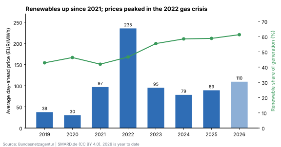
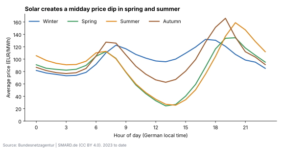
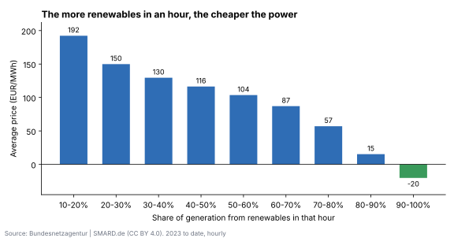
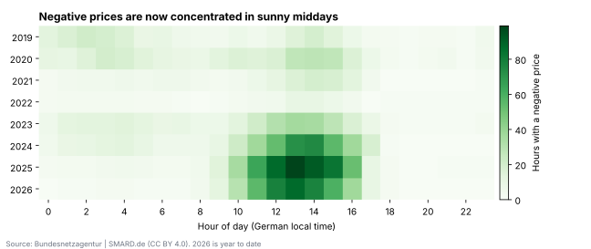

# German Electricity Market Analysis

**How does the growth of wind and solar change electricity prices in Germany, and what does that mean for companies that buy or sell power?**

Hourly day-ahead prices, electricity consumption and generation by source from **SMARD** (Bundesnetzagentur), analysed with Python, SQL and Power BI.

> **Status:** pipeline, SQL analysis, charts and key findings are complete (data from 1 Jan 2019 to 9 Oct 2026). Next: Power BI dashboard and a simple price model.

---

## Questions

1. How have average prices and the renewable share changed year by year?
2. Does midday solar push prices down, and when are the expensive evening peaks?
3. How much cheaper is an hour when renewables cover most of supply (merit-order effect)?
4. When do negative prices happen, and are they becoming more frequent?
5. What did the most expensive days have in common?
6. How big is the daily price spread, and what is it worth to shift demand or store power?

## Data

| | |
|---|---|
| Source | [SMARD.de](https://www.smard.de), Bundesnetzagentur |
| Licence | CC BY 4.0, "Bundesnetzagentur \| SMARD.de" |
| Resolution | hourly, German local time (Europe/Berlin) |
| Series | day-ahead price (DE-LU bidding zone), grid load, residual load, and generation from solar, wind onshore, wind offshore, biomass, hydro, other renewables, lignite, hard coal, natural gas, nuclear, pumped storage, other conventional |
| Units | generation and load in MWh per hour (= average MW), price in EUR/MWh |

**Definitions**

- *Renewable share* = (solar + wind onshore + wind offshore + biomass + hydro + other renewables) / total generation, calculated energy-weighted (`SUM / SUM`), not as an average of hourly shares.
- *Load-weighted price* = average price weighted by consumption in each hour, i.e. closer to what consumers actually pay than the simple average.
- 2022 is strongly affected by the gas-price crisis; the hourly-profile, merit-order and expensive-day analyses therefore use 2023 onwards.

## Project structure

```
German-Electricity-Market-Analysis/
├── src/
│   ├── 01_download_smard.py   ← downloads 15 hourly series from SMARD (cached, with retries)
│   ├── 02_load_sqlite.py      ← adds date parts and shares, loads SQLite, writes a Power BI CSV
│   └── 03_make_charts.py      ← builds the four charts below from the database
├── sql/
│   └── analysis.sql           ← 7 analysis queries, one per business question
├── tests/
│   ├── test_pipeline.py       ← offline end-to-end test of download, load and all queries
│   └── sample_week.json       ← one real week of SMARD data used by the test
├── outputs/charts/             ← charts used in this README (SVG)
├── data/                      ← created when you run the scripts (not in the repo)
├── requirements.txt
└── README.md
```

## How to run

```bash
python -m venv venv
venv\Scripts\activate            # macOS/Linux: source venv/bin/activate
pip install -r requirements.txt

python tests/test_pipeline.py                    # offline check, takes a few seconds
python src/01_download_smard.py --start 2019-01-01   # about 10-20 minutes the first time
python src/02_load_sqlite.py
python src/03_make_charts.py
```

Then run the queries in `sql/analysis.sql` against `data/energy.db` (for example with DB Browser for SQLite), or load `data/processed/hourly_powerbi.csv` into Power BI.

## Key findings

Data: 68,135 hours from 1 Jan 2019 to 9 Oct 2026. 2026 figures are year to date, so they are compared with the same period of 2025 where it matters.

### 1. Germany's power mix changed a lot, but power did not get cheaper



| | 2019 | 2022 | 2025 | 2026 (YTD) |
|---|---:|---:|---:|---:|
| Average day-ahead price (EUR/MWh) | 38 | 235 | 89 | 110 |
| Renewable share of generation | 43% | 47% | 59% | 61% |
| Solar share | 8% | 11% | 17% | 22% |
| Nuclear share | 14% | 7% | 0% | 0% |
| Coal share (lignite + hard coal) | 29% | 33% | 22% | 21% |

- The renewable share has risen every year since 2021 and is now above 60%. Nuclear ended in April 2023 and coal fell by about a quarter.
- Prices did **not** go back to pre-crisis levels. 2025 averaged 89 EUR/MWh, more than twice 2019. 2026 is even higher so far (110 vs 88 EUR/MWh for the same period of 2025).
- My reading is that renewables make *some* hours very cheap, but in the hours without enough wind and sun, gas and coal plants still set the price, and those plants have become more expensive since 2021.

### 2. Solar has created a deep midday price dip, and the expensive hours are now in the evening



- In spring and summer (2023 to date), power at 13:00-14:00 costs on average **25-27 EUR/MWh**, while at 20:00 it costs **135-159 EUR/MWh**: around **six times** more just a few hours later.
- Winter has almost no midday dip (about 96 EUR/MWh at 13:00) because there is little solar.
- **Business meaning:** a company that can move flexible consumption (cooling, charging, batch production, heat pumps with storage) from the evening to midday in spring and summer can buy most of that power at a fraction of the price.

### 3. The more renewables in an hour, the cheaper that hour (merit-order effect)



- Hours where renewables covered 10-20% of generation averaged **192 EUR/MWh**; hours with 50-60% averaged 104; hours with 80-90% averaged **15**; hours above 90% averaged **-20 EUR/MWh**.
- 35% of all hours in the 80-90% band and 87% of hours above 90% had negative prices.
- This shows correlation, not a full causal effect: high-renewable hours are also often low-demand hours (sunny weekends, spring holidays).

### 4. Negative prices are now common and almost all happen around midday



| Year | 2019 | 2022 | 2023 | 2024 | 2025 |
|---|---:|---:|---:|---:|---:|
| Hours with a negative price | 211 | 69 | 301 | 457 | 573 |
| Days with at least one negative hour | 39 | 12 | 46 | 88 | 101 |

- In 2019 negative prices were spread between windy nights and midday. Since 2023 most of them happen between **11:00 and 16:00**, which matches the solar peak.
- In 2025 more than one day in four had at least one negative hour.
- **Open question:** 2026 has fewer negative hours so far than 2025 (460 vs 562 for the same period) even though solar's share is higher. Possible reasons to investigate next: more battery storage, new rules for solar systems introduced in 2025, and the switch of the day-ahead market to 15-minute products in October 2025.

### 5. The most expensive days are cold, windless winter days ("Dunkelflaute")

- Of the 10 most expensive days since 2023, **7 were in November-January**, and on all 10 the average wind output was below 8 GW (the 2023-2026 average is 15.6 GW).
- The most expensive day was **12 December 2024**: 395 EUR/MWh on average, with only 1.5 GW of wind and an 18% renewable share.
- **Business meaning:** the biggest price risk for buyers is a few winter days with little wind, which is what hedging and fixed-price contracts protect against.

### 6. Daily price swings have grown fourfold, so flexibility is worth more

| Year | 2019 | 2021 | 2023 | 2024 | 2025 | 2026 (YTD) |
|---|---:|---:|---:|---:|---:|---:|
| Average daily spread, max - min (EUR/MWh) | 30 | 80 | 98 | 111 | 124 | 159 |

- The difference between the cheapest and the most expensive hour of a day has grown from 30 EUR/MWh in 2019 to 124 in 2025.
- As a rough upper bound, a battery that charges once a day in the cheapest hour and discharges in the most expensive one could earn about 124 EUR per MWh of capacity per day in 2025 (about 45,000 EUR per MWh per year), before losses, grid fees and the fact that nobody knows the exact cheapest and most expensive hours in advance.

### Limitations

- Day-ahead wholesale prices only: households and companies also pay grid fees, taxes and levies.
- The renewable share is calculated from German generation and does not include imports or exports.
- Since 1 October 2025 the day-ahead market trades 15-minute products; this project uses SMARD's hourly price series, so some short price spikes are smoothed out.

## Author

Sachini Hewahattage · [LinkedIn](https://www.linkedin.com/in/sachini-hewahattage)
